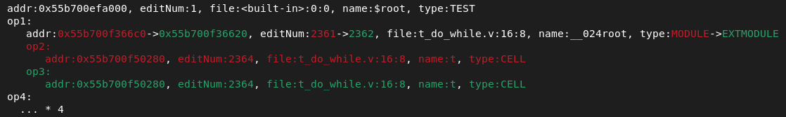
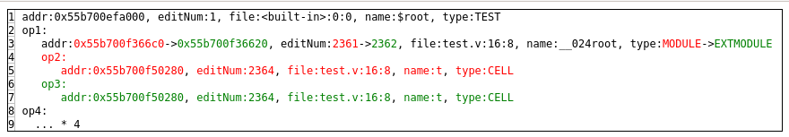
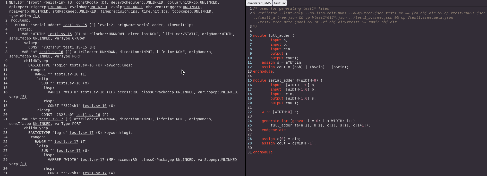

# `astsee`

Copyright (c) 2023-2024 [Antmicro](https://www.antmicro.com)

A suite of tools for pretty printing, diffing, and exploring abstract syntax
trees. You can use the generic `astsee` tool that accepts mostly arbitrary
tree-like structures in JSON format, or a variant for a specific AST type.
Currently, only [Verilator](https://github.com/verilator/verilator) JSON trees
are supported via `astsee_verilator`.

## Usage

Given two JSON files, `a.json`:

<!-- name="a.json" -->
```json
{
  "type": "TEST", "addr": "0x55b700efa000", "editNum": 1, "file": "<built-in>:0:0", "name": "$root",
  "op1": [
    {
      "type": "MODULE", "addr": "0x55b700f366c0", "editNum": 2361, "file": "test.v:16:8", "name": "__024root",
      "op2": [
        { "type": "CELL", "addr": "0x55b700f50280", "editNum": 2364, "file": "test.v:16:8", "name": "t" }
      ]
    }
  ], "op4": [
      { "type": "CELL", "addr": "0x55b700f50280", "editNum": 2364, "file": "test.v:16:8", "name": "t" },
      { "type": "CELL", "addr": "0x55b700f50280", "editNum": 2364, "file": "test.v:16:8", "name": "t" },
      { "type": "CELL", "addr": "0x55b700f50280", "editNum": 2364, "file": "test.v:16:8", "name": "t" },
      { "type": "CELL", "addr": "0x55b700f50280", "editNum": 2364, "file": "test.v:16:8", "name": "t" }
  ]
}
```

and `b.json`:

<!-- name="b.json" -->
```json
{
  "type": "TEST", "addr": "0x55b700efa000", "editNum": 1, "file": "<built-in>:0:0", "name": "$root",
  "op1": [
    {
      "type": "EXTMODULE", "addr": "0x55b700f36620", "editNum": 2362, "file": "test.v:16:8", "name": "__024root",
      "op3": [
        { "type": "CELL", "addr": "0x55b700f50280", "editNum": 2364, "file": "test.v:16:8", "name": "t" }
      ]
    }
  ], "op4": [
      { "type": "CELL", "addr": "0x55b700f50280", "editNum": 2364, "file": "test.v:16:8", "name": "t" },
      { "type": "CELL", "addr": "0x55b700f50280", "editNum": 2364, "file": "test.v:16:8", "name": "t" },
      { "type": "CELL", "addr": "0x55b700f50280", "editNum": 2364, "file": "test.v:16:8", "name": "t" },
      { "type": "CELL", "addr": "0x55b700f50280", "editNum": 2364, "file": "test.v:16:8", "name": "t" }
  ]
}
```

Run:

<!-- name="pretty-print" -->
```sh
astsee a.json
```

to pretty print it in a concise format:

<!-- name="pretty-print-output" -->
```
addr:0x55b700efa000, editNum:1, file:<built-in>:0:0, name:$root, type:TEST
 op1:
   addr:0x55b700f366c0, editNum:2361, file:test.v:16:8, name:__024root, type:MODULE
    op2:
      addr:0x55b700f50280, editNum:2364, file:test.v:16:8, name:t, type:CELL
 op4:
   addr:0x55b700f50280, editNum:2364, file:test.v:16:8, name:t, type:CELL
   addr:0x55b700f50280, editNum:2364, file:test.v:16:8, name:t, type:CELL
   addr:0x55b700f50280, editNum:2364, file:test.v:16:8, name:t, type:CELL
   addr:0x55b700f50280, editNum:2364, file:test.v:16:8, name:t, type:CELL
```

To produce a diff:

<!-- name="produce-diff" -->
```sh
astsee a.json b.json
```



There is also an option to generate HTML instead of ANSI text:

```sh
astsee a.json b.json --html > diff.html
firefox diff.html
```



To see all available options:

```sh
astsee --help
```

## Installation and usage

To install as an app, run:

```sh
pipx install git+https://github.com/antmicro/astsee
```

Or clone the repository, `cd` to it, and run:

<!-- name="install" -->
```sh
pipx install .
```

To install as a library, you need to create a virtual environment and install it there:

<!-- name="install-venv" -->
```sh
virtualenv astsee-venv
source astsee-venv/bin/activate
pip install .
```

As of now, `astsee` depends on `jq` being accessible in `PATH`.

On Ubuntu or Debian, you can install it with
```sh
apt install jq
```

## Verilator mode
Astsee provides a separate mode for interpreting Verilator AST dumps:
<!-- name="verilator-pretty-print" -->
```sh
astsee_verilator tests/verilator_in/test1_a.tree.json | head -n 10 # head for brevity
```

<!-- name="verilator-pretty-print-output" -->
```
NETLIST "$root" <built-in>:0 (B) constPoolp:(D), delaySchedulerp:UNLINKED, dollarUnitPkgp:UNLINKED, dpiExportTriggerp:UNLINKED, evalNbap:UNLINKED, evalp:UNLINKED, nbaEventTriggerp:UNLINKED, nbaEventp:UNLINKED, stdPackagep:UNLINKED, timeprecision:1ps, timeunit:1ps, topScopep:UNLINKED, typeTablep:(C)
 modulesp:
   MODULE "serial_adder" test1.sv:15 (E) level:2, origName:serial_adder, timeunit:1ps
    stmtsp:
      VAR "WIDTH" test1.sv:15 (F) attrClocker:UNKNOWN, direction:NONE, lifetime:VSTATIC, origName:WIDTH, sensIfacep:UNLINKED, varType:GPARAM
       valuep:
         CONST "?32?sh8" test1.sv:15 (H)
      VAR "a" test1.sv:16 (J) attrClocker:UNKNOWN, direction:INPUT, lifetime:NONE, origName:a, sensIfacep:UNLINKED, varType:PORT
       childDTypep:
         BASICDTYPE "logic" test1.sv:16 (K) keyword:logic
```

For brevity, some common fields like `type` or `name` are printed without the key.

The `--html` option provides rich features such as jumping between corresponding AST nodes and source lines:
```sh
astsee_verilator tests/verilator_in/test1_a.tree.json --html > foo.html
firefox foo.html
# Or to open generated file directly in browser:
astsee_verilator tests/verilator_in/test1_a.tree.json --htmlb
```



## Dev install

To install project in editable mode (so changes are immediately reflected in executable), with extra dependencies meant for development only (like test framework):

clone repo, `cd` to it, and run:
```sh
pip install -e '.[dev]'
```

You may also want to do `npm install .` to get `node_modules/.bin/eslint`

## Tests

To run main tests, invoke:

<!-- name="test" -->
```sh
pytest
```

in project root. To update tests:

```sh
pytest --golden
# or
ASTSEE_UPDATE_GOLDEN=1 pytest
```

## Make

To run all tests, linters and format-checkers, invoke:

```sh
make
```

in project root. To auto-apply linter/formatter fixes, run:

```sh
make autofix
```

## Known limitations/bugs

- Arrays of scalars or arrays of array work only in `--basic` mode
- Diff doesn't support direct replacement of root node
- `astsee_verilator --html` tests are unstable due to usage of Python's `set`
